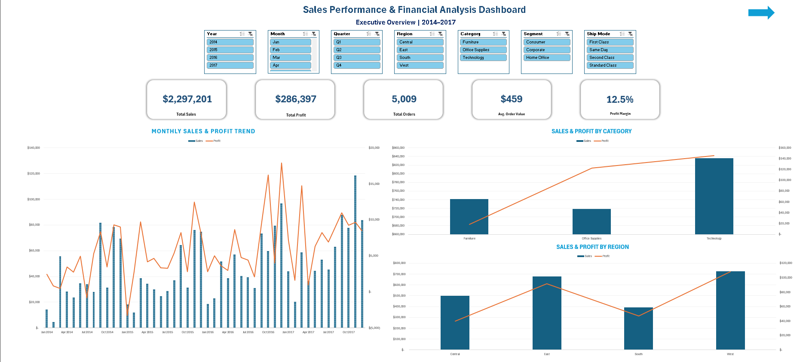
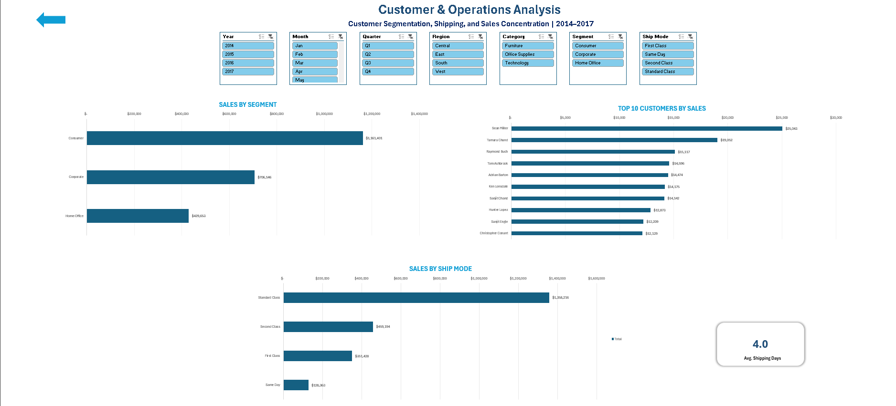
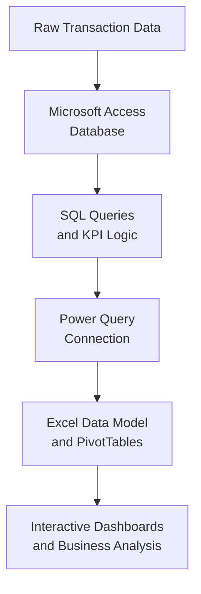

# Sales Performance & Financial Analysis Dashboard

An end-to-end finance and business analytics project that transforms raw retail transactions into a normalized Microsoft Access database, reusable SQL analysis, and two connected interactive Excel dashboards.

The solution evaluates historical sales performance, profitability, customer behavior, product categories, regional performance, shipping activity, and operational trends from 2014 through 2017. It demonstrates how raw transactional data can be transformed into reliable business insights through database design, SQL analysis, and interactive dashboard reporting.

## Scenario Disclosure

This portfolio project uses a public sample dataset within a fictional retail business scenario. The company, management assignment, and strategic context are hypothetical, while all calculations, findings, and recommendations are derived from the underlying dataset.

## Dashboard Preview

### Executive Dashboard



### Customer & Operations Dashboard



## Executive Summary

The dataset contains 9,994 transaction lines representing 5,009 unique orders. Across the four-year period, the business generated $2.30 million in sales and $286,397 in profit, producing an overall profit margin of 12.47%.

Performance strengthened considerably after a small sales decline in 2015. Sales increased 29.47% in 2016 and another 20.36% in 2017, making 2017 the strongest year for both sales and profit. The analysis also identified material differences in profitability across product categories, regions, customers, and discount levels. Technology and Office Supplies produced strong margins, while Furniture generated substantial revenue but only a 2.49% margin.

## Business Objective

The objective was to create a reliable and interactive analytical solution that enables management to:

- Monitor core financial and operational KPIs.
- Evaluate sales and profit performance over time.
- Compare results across products, regions, customers, segments, and shipping modes.
- Identify areas of strong performance and possible margin pressure.
- Support evidence-based decisions through transparent and validated calculations.

## Core KPIs

| KPI | Validated Result |
|---|---:|
| Total Sales | $2,297,200.86 |
| Total Profit | $286,397.02 |
| Profit Margin | 12.47% |
| Unique Orders | 5,009 |
| Average Order Value | $458.61 |
| Average Shipping Time | 3.96 days |

## Key Findings

### 1. Growth accelerated during the final two years

Sales declined 2.83% in 2015 before increasing 29.47% in 2016 and 20.36% in 2017. Profit increased every year, although profit growth slowed from 32.74% in 2016 to 14.24% in 2017. This indicates continued expansion with some moderation in the rate of profit growth.

### 2. Technology led both sales and profit performance

Technology generated $836,154 in sales and $145,455 in profit, representing a 17.40% margin. Office Supplies produced a similar 17.04% margin. Furniture generated $742,000 in sales but only $18,451 in profit, resulting in a 2.49% margin and a clear profitability gap.

At the subcategory level, Tables lost $17,725 and Bookcases lost $3,473 despite generating more than $321,000 in combined sales. These results make Furniture pricing, cost structure, product mix, and discount practices important areas for further investigation.

### 3. Regional performance was uneven

The West was the strongest region, producing $725,458 in sales, $108,418 in profit, and a 14.94% margin. The Central region generated $501,240 in sales but achieved only a 7.92% margin, the lowest of the four regions. The difference suggests that regional sales volume should be evaluated together with profitability rather than in isolation.

### 4. Demand was concentrated late in the year

September through December generated approximately 51.6% of total sales. November was the highest-sales month across the combined four-year period, followed by December and September. This recurring concentration has implications for sales planning, staffing, fulfillment capacity, and cash-flow preparation.

### 5. Revenue contribution did not always indicate customer profitability

Sean Miller was the highest-sales customer at $25,043, but the account generated a $1,981 loss. Several other leading customers produced strong profit margins. This demonstrates why customer performance should be measured using both sales and profit contribution.

### 6. Customer segments had different volume and margin profiles

The Consumer segment contributed 50.56% of total sales and was the largest segment by revenue. However, Home Office produced the highest segment margin at 14.03%, compared with 13.03% for Corporate and 11.55% for Consumer.

## Business Recommendations

1. **Prioritize profitable growth within Furniture.** Review Tables and Bookcases by product, customer, region, and discount level to determine where losses are concentrated. Management should evaluate pricing and cost drivers before expanding sales volume in these subcategories.

2. **Strengthen discount controls.** Transactions with discounts above 20% produced negative aggregate margins in this dataset. Establish approval thresholds and monitor discount performance by category and customer. This is an observed relationship and should not be treated as proof that discounts alone caused the losses.

3. **Develop a Central-region margin improvement plan.** Compare the region's product mix, discounting, customer mix, and fulfillment costs with the West and East to identify the most actionable sources of the margin gap.

4. **Plan operating capacity around late-year demand.** Use the September–December concentration to prepare staffing, shipping capacity, working capital, and customer-service resources before peak demand.

5. **Add customer profitability to account reviews.** Evaluate major customers using sales, profit, margin, order frequency, and discount behavior rather than ranking accounts only by revenue.

## Analytical Architecture


## Data Model

The raw source was reorganized into a relational structure to improve calculation accuracy, reduce unnecessary duplication, and support reusable analysis.

| Table | Purpose |
|---|---|
| `RawSalesData` | Preserves the original imported source for traceability |
| `Orders` | Stores order-level dates, region, and shipping information |
| `Customers` | Stores customer, segment, and geographic attributes |
| `Products` | Stores product, category, and subcategory attributes |
| `OrderDetails` | Stores line-level sales, quantity, discount, and profit |

A surrogate `ProductKey` was introduced because the original `ProductID` was not sufficiently unique by itself. Primary keys, foreign keys, and enforced relationships were used to maintain referential integrity.

## Dashboard Features

The workbook contains two synchronized dashboard pages:

- **Executive Dashboard:** Total Sales, Total Profit, Profit Margin, Unique Orders, Average Order Value, monthly trends, category performance, and regional performance.
- **Customer & Operations Dashboard:** Average Shipping Time, Top 10 Customers, customer segment performance, and shipping-mode performance.

Seven slicers—Year, Quarter, Month, Category, Region, Segment, and Ship Mode—are connected across all dashboard PivotTables and charts.

## Validation and Quality Control

The final solution was tested across the source data, Access database, SQL outputs, Excel tables, Data Model, PivotTables, charts, and KPI cards.

Key controls included:

- Reconciling 9,994 transaction lines and 5,009 unique orders.
- Confirming that SQL joins did not multiply transaction records.
- Reconciling total sales and profit across the source, database, and workbook.
- Calculating Total Orders as a distinct count rather than a line-item count.
- Calculating Average Order Value using total sales divided by unique orders.
- Calculating average shipping time at the order level.
- Testing chronological month sorting and descending chart rankings.
- Testing all seven slicers across all 11 connected PivotTables.
- Running a complete Power Query refresh and checking for formula or connection errors.

## Tools and Skills Demonstrated

- Microsoft Access database development
- Relational data modeling and normalization
- SQL joins, aggregations, KPI queries, date logic, and grouped analysis
- Excel Power Query connections and refresh management
- Excel Data Model and PivotTable analysis
- PivotCharts, KPI cards, slicers, and interactive dashboard design
- Financial KPI development and reconciliation
- Business interpretation, recommendations, and technical documentation

## Repository Structure

```text
Sales-Performance-Financial-Analysis/
├── README.md
├── data/
│   └── Sample-Superstore-Dataset.xlsx
├── database/
│   └── Sales-Performance-Database.accdb
├── dashboard/
│   └── Sales-Performance-Financial-Analysis-Dashboard.xlsx
├── documentation/
│   └── Sales-Performance-Financial-Analysis-Report.pdf
└── images/
    ├── executive-dashboard.png
    └── customer-operations-dashboard.png
```

## How to Use the Dashboard

1. Download the Excel workbook from the `dashboard` folder.
2. Open it in the desktop version of Microsoft Excel.
3. Begin on the `Project Overview` sheet.
4. Use the two dashboard tabs to review financial, customer, and operational performance.
5. Use the synchronized slicers to filter results by time period and business dimension.

For the clearest view on a smaller screen, use Excel's full-screen mode and adjust the zoom level as needed.

## Limitations

- The analysis is descriptive and based on historical transactions from 2014–2017.
- The dataset does not include product costs, inventory levels, marketing activity, customer acquisition cost, service quality, or external market conditions.
- The results identify patterns and priorities for investigation but do not establish causation.
- Forecasting, predictive modeling, customer lifetime value, and inventory optimization are outside the current project scope.
- The source is a public sample dataset and does not represent confidential company information.

## AI-Assisted Development

AI tools supported technical troubleshooting, documentation review, and quality assurance. Database design decisions, KPI definitions, calculations, dashboard outputs, findings, and recommendations were reviewed and validated before inclusion.
